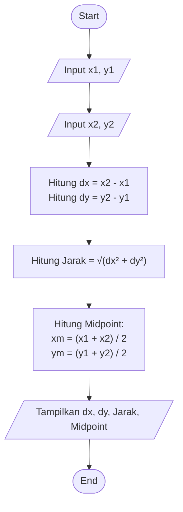

# Pertemuan 02 - Dasar Python dan Pengumpulan GitHub

**Identitas Mahasiswa**
* **Nama** : Amandita Pebriana Putri
* **NIM** : 2225250134
* **Kelas** : 3A Pendidikan Matematika

---

## Deskripsi Repositori
Repositori ini berisi latihan dasar pemrograman Python (variabel, tipe data, input-output, operator) serta tugas kalkulator koordinat untuk Pertemuan 02.

## Struktur Berkas
* `latihan/01_biodata.py` : Latihan variabel dan tipe data string.
* `latihan/02_persegi_panjang.py` : Latihan menghitung luas persegi panjang.
* `latihan/03_konversi_suhu.py` : Latihan konversi Celsius ke Fahrenheit.
* `latihan/04_nilai_akhir.py` : Latihan menghitung bobot nilai.
* `tugas/kalkulator_koordinat.py` : Menghitung dx, dy, jarak Euclidean, dan titik tengah dua titik.


## Cara Menjalankan Program

### 1. Menjalankan Berkas Latihan
```bash
python latihan/01_biodata.py
python latihan/02_persegi_panjang.py
python latihan/03_konversi_suhu.py
python latihan/04_nilai_akhir.py
```

### 2. Menjalankan Tugas Utama (Kalkulator Koordinat)
```bash
python tugas/kalkulator_koordinat.py
```

## Flowchart Program



## Hasil Pengujian (Test Case Wajib)
| Kasus | Titik A | Titik B | Jarak Euclidean | Titik Tengah | Status |
| :---: | :---: | :---: | :---: | :---: | :---: |
| 1 | (0, 0) | (3, 4) | 5.00 | (1.50, 2.00) | Valid |
| 2 | (-2, 1) | (4, 1) | 6.00 | (1.00, 1.00) | Valid |
| 3 | (2.5, -1) | (2.5, 3) | 4.00 | (2.50, 1.00) | Valid |

## Refleksi

* **Konsep yang paling saya pahami adalah** penggunaan konversi tipe data (`float(input())`) untuk membaca input dari pengguna serta pemformatan string (`f"{nilai:.2f}"`) untuk menyajikan angka desimal dengan presisi dua digit.
* **Kesalahan yang saya temukan adalah** memahami urutan input angka koordinat pada terminal saat program pertama kali dijalankan, dan saya telah memperbaikinya dengan menambahkan petunjuk input yang lebih jelas.
* **Pada pertemuan berikutnya saya ingin lebih memahami** penerapan struktur kondisi (`if-else`) untuk memvalidasi input pengguna serta penggunaan fungsi (function) agar kode program lebih modular.

## Sumber Referensi

* Modul Bahan Ajar Pertemuan 02 Algoritma dan Pemrograman - Dr. Aan Hendrayana, S.Si., M.Pd.


